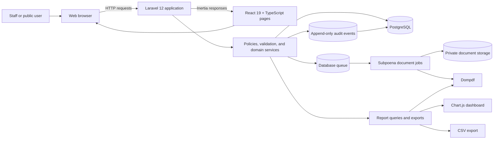

# LexVerdict

LexVerdict is a modern case-management application for a prosecutor's office. It rebuilds a validated legacy workflow as a Laravel modular monolith with a React and Inertia.js interface, PostgreSQL-backed data integrity, role-based authorization, private document generation, reporting, and an append-only audit trail.

The technical implementation is complete for local demonstration and testing. Production release remains pending the Owner/Environment requirements in the [release checklist](docs/m8/RELEASE_CHECKLIST.md).

## Project Overview

LexVerdict manages the operational lifecycle of prosecutor-office Cases while preserving the approved domain model:

- A **Case** is the primary domain record.
- A **Subpoena** is the versioned reviewable document and approval workflow associated with a Case.
- **Subpoena Status**, **Resolution Status**, and **Resolution Verdict** remain separate concepts.
- Legal documents, workflow transitions, role boundaries, and domain terminology remain server-authoritative.

The application uses server-driven Inertia pages rather than a separate public API. Laravel owns authentication, authorization, validation, workflow decisions, persistence, queues, reports, and document access; React provides the authenticated interaction and presentation layer.

## Key Features

- Username-based staff authentication with active/deactivated account enforcement.
- Role-aware navigation and server-side authorization for Administrator, Secretary, Prosecutor, and Process Server users.
- Administrator user management and one-to-one Prosecutor-Secretary assignment management with immutable assignment history.
- Administrator-managed Crime catalog with canonical offense IDs, search, validation, reference protection, and audit events.
- Case creation and revision with atomic docket allocation, dynamic parties, multiple Crimes, canonical Philippine address selection, and optimistic revision conflict protection.
- Secure six-digit public lookup PINs stored as hashes and never exposed in authenticated lists.
- Assigned-Prosecutor Subpoena review with approval, denial comments, revision comparison, resubmission, and immutable decision history.
- Resolution submission, revision, approval, denial, verdict, Court, and decision-history workflows with database-enforced integrity.
- Queued official Subpoena PDF generation from immutable request-time snapshots, private storage, checksums, version history, and authorized inline viewing.
- Public docket-and-PIN lookup with throttling, timing-balanced failures, no-store responses, and approved outcome projection.
- Administrator Reports with interactive charts, legacy filters, Case Summary, PDF export, CSV export, and browser-print support.
- Administrator Audit History with searchable technical events, readable operational presentation, redaction, event details, and append-only database protection.
- Responsive desktop and mobile presentations, keyboard navigation, visible focus, semantic validation feedback, and automated accessibility coverage.
- Release configuration checks, queue-worker guidance, health monitoring, backup/restore evidence, rollback procedures, UAT preparation, and training documentation.

## Role-Based Access

| Role               | Primary capabilities                                                                                                                          | Landing experience                                        |
| ------------------ | --------------------------------------------------------------------------------------------------------------------------------------------- | --------------------------------------------------------- |
| **Administrator**  | Operational dashboard, global Case visibility, users, assignments, Crime catalog, Resolution Review, Reports, and Audit History               | Dashboard                                                 |
| **Secretary**      | Assignment-scoped Case creation and revision, Verifying Cases workspace, Resolution submission/revision, and authorized Subpoena PDF requests | Cases                                                     |
| **Prosecutor**     | Assigned Case visibility and assigned pending Subpoena approval/denial review                                                                 | Subpoena Review when pending work exists; otherwise Cases |
| **Process Server** | Searchable, sortable, paginated read-only Case list with approved final Resolution outcomes                                                   | Cases                                                     |

The Process Server cannot view PINs, open Case-management details, mutate Cases, decide Subpoenas or Resolutions, or access administrative modules.

## Architecture

LexVerdict is a server-driven modular monolith. Business rules and authorization remain in Laravel; frontend components consume already-authorized Inertia props.



For architectural decisions, see the [M0 ADRs](docs/m0/ADR-0001-inertia-monolith.md) and [domain catalog](docs/m0/DOMAIN_CATALOG.md).

## Technology Stack

| Area              | Technology                                                 |
| ----------------- | ---------------------------------------------------------- |
| Backend           | PHP 8.2+, Laravel 12                                       |
| Frontend          | React 19, TypeScript 5, Inertia.js 3                       |
| Styling and build | Tailwind CSS 4, Vite 7                                     |
| Database          | PostgreSQL 16 or compatible PostgreSQL                     |
| Charts            | Chart.js, react-chartjs-2                                  |
| PDF generation    | Dompdf                                                     |
| Queues and state  | Laravel database queues, database sessions, database cache |
| Backend quality   | PHPUnit 11, Laravel Pint, Larastan/PHPStan                 |
| Browser quality   | Playwright, axe-core                                       |

## Installation and Local Development

### Prerequisites

- PHP 8.2 or newer with `pdo_pgsql`
- Composer
- Node.js 22 or a compatible current LTS release
- PostgreSQL 16 or compatible PostgreSQL

### Install dependencies

```powershell
git clone https://github.com/nicolaseugenio2022-cyber/Lexverdict-laravel.git
cd Lexverdict-laravel
composer install
npm install
Copy-Item .env.example .env
php artisan key:generate
```

Create an empty PostgreSQL database:

```powershell
createdb -U postgres lexverdict_local
```

Configure the local database in `.env`:

```dotenv
APP_ENV=local
APP_URL=http://127.0.0.1:8000

DB_CONNECTION=pgsql
DB_HOST=127.0.0.1
DB_PORT=5432
DB_DATABASE=lexverdict_local
DB_USERNAME=postgres
DB_PASSWORD=your-local-password

SESSION_DRIVER=database
CACHE_STORE=database
QUEUE_CONNECTION=database
```

Run the migrations:

```powershell
php artisan migrate
```

Start the application, queue listener, development log stream, and Vite from one command:

```powershell
npm run dev
```

Open `http://127.0.0.1:8000/login`. Public Case Lookup is available at `http://127.0.0.1:8000/docket`.

### Optional demo data

The local demo seeder creates synthetic records and accounts for all four roles. It refuses to run outside `APP_ENV=local` and requires an empty domain database.

> `migrate:fresh` destroys every table in the configured database. Confirm that `.env` points to a disposable local database first.

```powershell
php artisan migrate:fresh --force
php artisan db:seed --class=LocalDemoSeeder --force
```

See [Localhost Demonstration](docs/m8/LOCALHOST_DEMO.md) for the synthetic credentials and representative workflow data. Additional environment guidance is available in [Local Setup](docs/m0/LOCAL_SETUP.md).

## Testing

Create the PostgreSQL testing database and local testing environment:

```powershell
createdb -U postgres lexverdict_test
Copy-Item .env.testing.example .env.testing
php artisan key:generate --env=testing
```

Run the static, backend, and build checks:

```powershell
composer validate --strict
composer format -- --test
composer analyse
npm run lint
npm run typecheck
npm run build
php artisan test
```

Run dependency audits:

```powershell
composer audit
npm audit --audit-level=high
```

Run the browser suite against the disposable testing database:

```powershell
npx playwright install chromium
php artisan migrate:fresh --env=testing --force
php artisan db:seed --class=Database\Seeders\M8E2ESeeder --env=testing --force
npm run build
npm run test:e2e
```

The browser suite includes cross-role workflows, public lookup, responsive behavior, keyboard interaction, accessibility checks, and pinned Linux visual snapshots for the Reports page. Never run the browser reset commands against staging or production.

Operational verification, backup/restore, queue, health-check, and rollback procedures are documented in the [Operations Runbook](docs/m8/OPERATIONS_RUNBOOK.md).

## Screenshots

Curated portfolio screenshots are not yet tracked in the repository. The intended gallery is reserved below without linking disposable test artifacts.

| View                           | Screenshot status                   |
| ------------------------------ | ----------------------------------- |
| Staff Login                    | Placeholder - curated image pending |
| Administrator Dashboard        | Placeholder - curated image pending |
| Cross-role Cases               | Placeholder - curated image pending |
| Subpoena and Resolution Review | Placeholder - curated image pending |
| Administrator Reports          | Placeholder - curated image pending |
| Audit History                  | Placeholder - curated image pending |

## Implementation Progress

### Core milestones

M0 through M8 are technically complete. M8 prepared the application for local demonstration and testing with security, accessibility, performance, queue, monitoring, backup/restore, rollback, UAT, training, and release-readiness evidence.

### Acceptance remediation

| Slice     | Delivered scope                                                                                       | Status                        |
| --------- | ----------------------------------------------------------------------------------------------------- | ----------------------------- |
| 1 and 1.5 | Case/Subpoena model, Process Server read-only Cases, and authoritative role landing behavior          | Complete                      |
| 2         | Administrator Crime catalog management and authenticated layout corrections                           | Complete                      |
| 3         | Secretary Verifying Cases workspace                                                                   | Complete                      |
| 4         | Interactive legacy Reports dashboard and export preservation                                          | Complete                      |
| 5         | Crime autocomplete and cascading Philippine addresses                                                 | Complete                      |
| 6         | Cross-role legacy Case-list parity                                                                    | Complete                      |
| 7         | Remaining workflow and queued-document lifecycle parity                                               | Complete                      |
| 8         | Presentation, responsive, and accessibility remediation                                               | Complete                      |
| 9         | Additional legacy parity corrections and source-reviewed catalog preparation                          | Complete                      |
| 10        | Cohesive institutional visual system                                                                  | Complete                      |
| 11        | Role-appropriate operational landing experiences while preserving Administrator-only dashboard access | Implemented on current `main` |

Production deployment is not complete. Every unchecked Owner/Environment gate in the [Release Checklist](docs/m8/RELEASE_CHECKLIST.md) remains mandatory before staging or production release.

## Future Improvements

- Complete the documented Owner/Environment approvals before staging or production deployment.
- Provision and verify production queue workers, scheduler, monitoring, alert ownership, backups, and rollback procedures in the target environment.
- Complete legal-office validation before any production use of the prepared Revised Penal Code catalog data.
- Add curated, privacy-safe portfolio screenshots to the repository.

No additional workflow or domain functionality is implied by this list; future product changes require separate approval.

## License

This project declares the [MIT License](https://opensource.org/license/mit) in `composer.json`. A standalone license file is not currently included in the repository.
